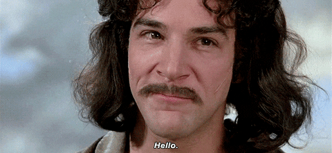
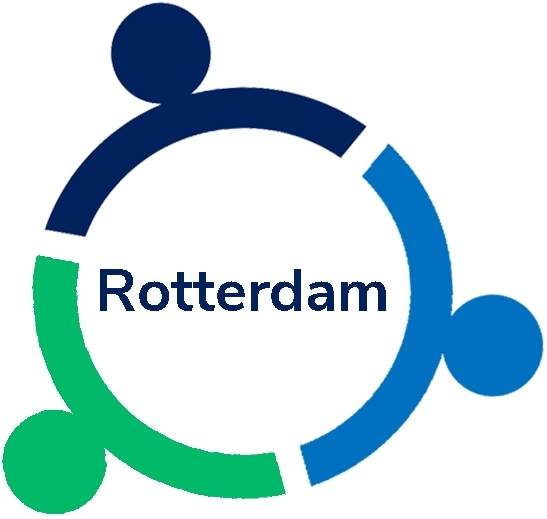
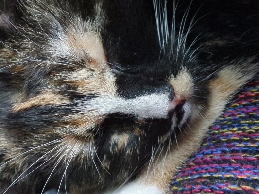

# Hi, I'm Antonio

- 💬 Happy to chat about open research
- 👯 Open to collaborate on projects related to open science, emotion, attention, and visual perception
- 🔗 Visit my [website](https://antonio-schettino.com)
- 🐘 Find me on [Mastodon](https://fediscience.org/@antonioschettino)

***

## My job &nbsp;&nbsp;&nbsp;&nbsp;&nbsp;&nbsp; 

I am Head of Open and Responsible Science (ORS) at [**Engagement & Research Services**](https://www.eur.nl/en/research/research-services), a department within Professional Services at [*Erasmus University Rotterdam*](https://www.eur.nl/en). My responsibilities include:
- leading the development of vision, strategy, and mid-term goals of the ORS team;
- ensuring connection and collaboration with other departments, within Erasmus Research Services and the university at large;
- organizing, directing, and conducting everyday and existing activities of the department and managing its human and material resources.

## OSCR &nbsp;&nbsp;&nbsp;&nbsp;&nbsp;&nbsp; 

I am founder and former coordinator of the [**Open Science Community Rotterdam**](https://www.openscience-rotterdam.com/home/) (OSCR), a bottom-up community where researchers and support staff discuss and learn about open research practices. OSCR is part of the [**International Network of Open Science & Scholarship Communities**](https://doi.org/10.1093/scipol/scab039) (INOSC), which embraces many communities in the Netherlands and other regions in the world... and we are expanding! 

***

## In my spare time...

I am an independent researcher affiliated with the [**Institute for Globally Distributed Open Research and Education**](https://igdore.org) (IGDORE). I use behavioral tasks and non-invasive electrical brain activity to study emotion, attention, and visual perception. I analyze these complex datasets using a variety of approaches, for example mass univariate analysis of event-related brain potentials and Bayesian multilevel modeling.

***

# Here is my cat, Elfi Jones

***
